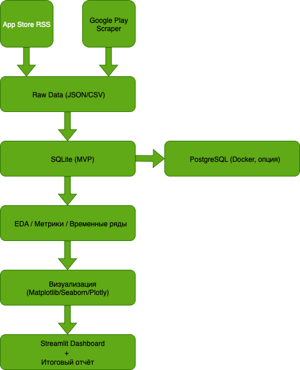

# 📱 Global App Market Analytics (2015–2025)

## 📌 Описание проекта
Цель проекта — исследовать глобальные тренды мобильного рынка приложений за последние 5–10 лет.  
Мы анализируем данные **App Store (iOS)** и **Google Play (Android)**, чтобы понять:  
- какие **категории приложений** чаще становятся коммерчески успешными,
- какие факторы влияют больше других на коммерческий успех приложений, 
- какие **регионы и страны** наиболее перспективны,  
- как распределяется успех между двумя экосистемами (iOS vs Android),
- как меняются со временем тренды на рынке приложений

---

## 🎯 Исследовательские вопросы
- Какие категории (Games, Health, Finance, Productivity и др.) приносят наибольшую выручку?  
- Какие регионы/страны лидируют по ARPU и где наблюдается наибольший рост YoY?  
- Как распределяется коммерческий успех между App Store и Google Play?  
- Влияет ли уровень экономического развития (GDP PPP per capita) на структуру топов?  
- Отличаются ли предпочтения в странах с разным климатом (сезонность)?  
- Какие факторы влияют больше других на коммерческий успех приложений?
- Сколько времени в среднем проходит от релиза до попадания в топ-grossing?  
- Какие модели монетизации (подписка, IAP, разовый платёж) доминируют в разных категориях?  
- Кто держится дольше в топах: глобальные бренды или локальные разработчики?  
- Какие на данный момент наиболее перспективные (какие категории приложений и на каких рынках)

---

## ⚙️ Пайплайн проекта

Оркестрация — **Prefect**, ежедневное обновление данных (по cron).  

---

## 🛠️ Технологический стек
- **Сбор данных**: `requests`, `BeautifulSoup`, `google-play-scraper`, App Store RSS.  
- **Хранилище**:  
  - MVP: SQLite (`sqlite-utils`, `sqlalchemy`),  
  - Продвинутая версия: PostgreSQL (`psycopg2-binary`, Docker).  
- **Обработка**: `pandas`, `numpy`, `polars`.  
- **EDA и статистика**: `seaborn`, `matplotlib`, `plotly`, `statsmodels`.  
- **ML (по желанию)**: `scikit-learn`, `xgboost` — модели факторов успеха.  
- **Оркестрация**: `Prefect` (с возможностью перехода на Airflow).  
- **Дашборд**: `Streamlit` (финальный отчёт).  
- **DevOps**: Docker, docker-compose.  

---

## 📂 Структура репозитория
app-market-analytics/
├── data/
│   ├── raw/          # сырые данные (JSON/CSV)
│   ├── interim/      # очищенные данные
│   ├── processed/    # агрегаты и фичи
│   └── app_market.db # SQLite база (MVP)
├── notebooks/        # Jupyter для EDA и анализа
├── src/
│   ├── scraping/     # парсинг App Store и Google Play
│   ├── processing/   # очистка, нормализация
│   ├── metrics/      # расчёт AUC, persistence и др.
│   ├── viz/          # визуализация
│   └── db/           # работа с БД (SQLite + PostgreSQL)
│       └── db_utils.py
├── reports/          # отчёты, презентации
├── requirements.txt  # зависимости
├── docker-compose.yml # (для PostgreSQL)
└── README.md

---

## 📊 Визуализации

Все основные графики и диаграммы сохраняются в папку [`reports/figures/`](reports/figures/).  

Примеры:  
-   
-   
-   

---

## 📅 План (9–26 сентября 2025)
- Неделя 1: сбор данных (App Store + Google Play), настройка Prefect.
- Неделя 2: очистка, объединение, первичный EDA, расчёт метрик.  
- Неделя 3: 
    - финальные графики, когорты, YoY-анализ, дашборд, отчёт.  
    - опционально: перенос из SQLite в PostgreSQL (через Docker + sqlalchemy).
---

## 🚀 Итоговые артефакты
- GitHub-репозиторий с кодом и данными.  
- Визуализации: графики и карты.  
- Streamlit-дашборд (по категориям, странам, OS).  
- Финальный отчёт: «Global App Market 2015–2025: Insights & Opportunities».  